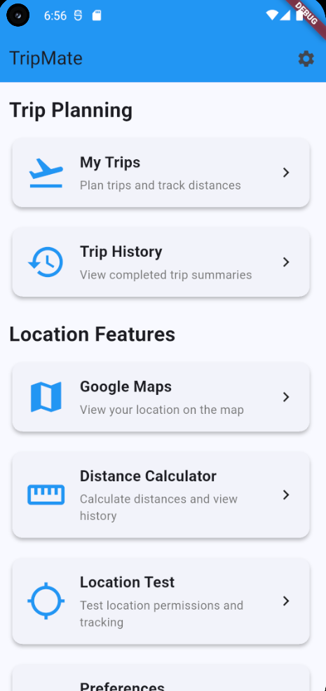
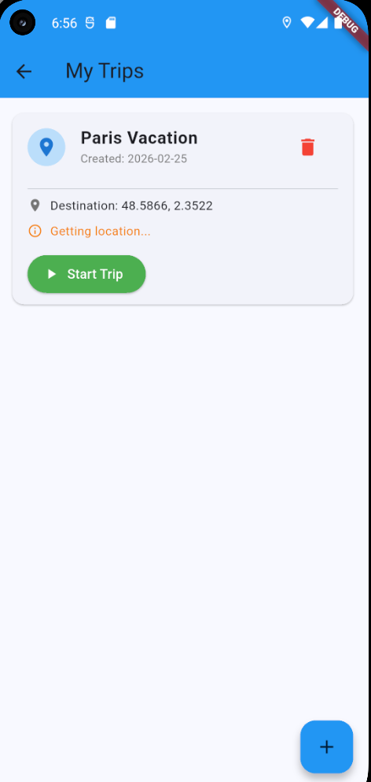
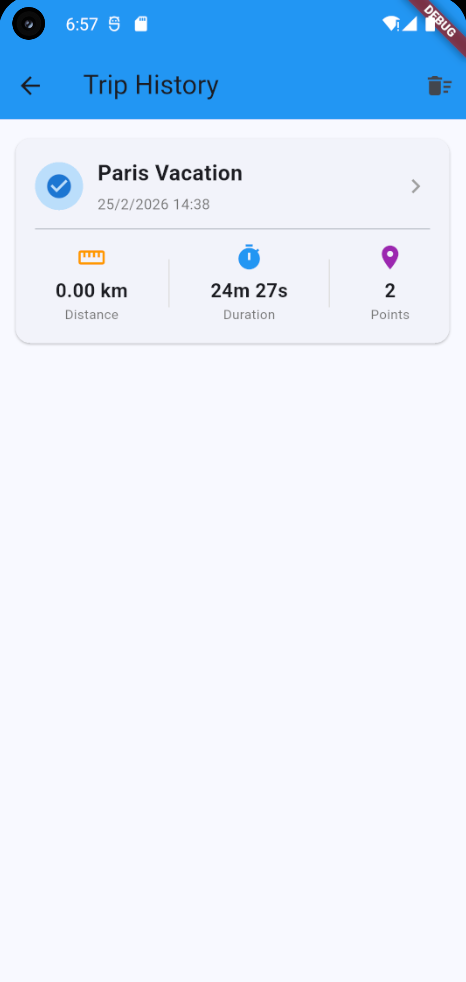
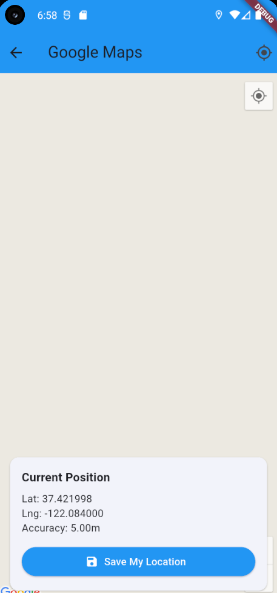
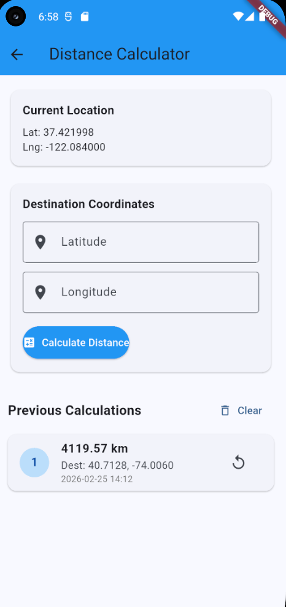
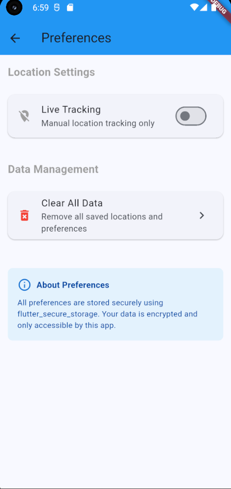

# TripMate

Aplicación móvil de planificación de viajes desarrollada en Flutter.

## Descripción

TripMate es un trip planner que permite a los usuarios organizar y gestionar sus viajes de manera eficiente. El proyecto está actualmente en desarrollo con funcionalidades clave ya implementadas.

## Avances Realizados

### ✅ Navegación y Estructura
- **Menú principal funcional** con acceso intuitivo a todos los módulos de la aplicación
- Sistema de navegación entre pantallas implementado con Flutter Router
- Interfaz de usuario responsive adaptada a diferentes tamaños de pantalla

### ✅ Gestión de Viajes
- **Módulo de creación de viajes** completo con formularios personalizados
- Visualización de lista de trips activos y planificados
- Sistema de almacenamiento de información de viajes
- Detalles completos de cada viaje con toda la información relevante

### ✅ Historial y Seguimiento
- **Historial de viajes completados** con registro detallado
- Visualización cronológica de viajes pasados
- Estadísticas básicas de viajes realizados

### ✅ Integración con Mapas
- **Google Maps API completamente integrada** en la aplicación
- Visualización interactiva de ubicaciones y rutas
- Marcadores personalizados para puntos de interés
- **Sistema de cálculo de distancias** entre múltiples ubicaciones
- Estimación de tiempos de viaje

### ✅ Geolocalización
- **Servicio de localización en tiempo real** implementado
- Detección automática de ubicación del usuario
- Pruebas de precisión de GPS funcionando correctamente
- Permisos de ubicación manejados adecuadamente

### ✅ Configuración
- **Panel de preferencias de usuario** completamente funcional
- Personalización de opciones de la aplicación
- Configuración de unidades de medida (km/millas)
- Ajustes de notificaciones y privacidad

## Capturas de Pantalla

  
  
  

  
  
  

## Tecnologías

- Flutter
- Google Maps API
- Geolocalización
