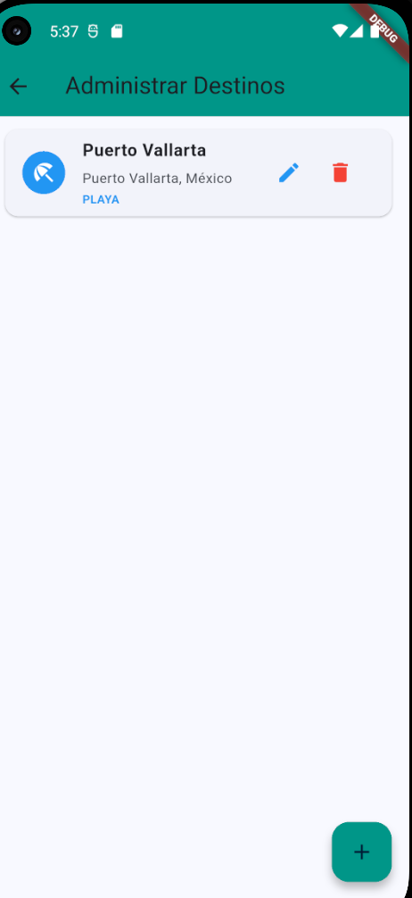
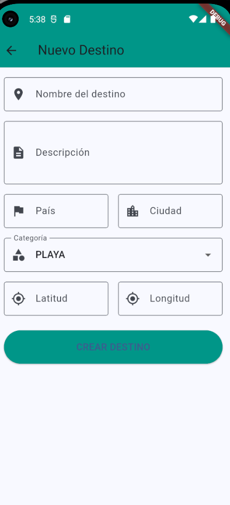

# TripMate

Aplicación móvil de planificación de viajes desarrollada en Flutter.

## 🆕 Novedades

### Sistema de Administración de Contenidos (CMS) - Firebase Integration
Se implementó exitosamente un sistema completo de gestión de contenidos turísticos integrado con Firebase Cloud Firestore, permitiendo la administración centralizada de destinos turísticos para su consumo desde la aplicación móvil.

**Funcionalidades implementadas:**
- ✅ **CRUD completo de destinos turísticos** (Crear, Leer, Actualizar, Eliminar)
- ✅ **Integración con Firebase Firestore** para almacenamiento en tiempo real
- ✅ **Panel de administración** con interfaz intuitiva
- ✅ **Formularios de gestión** con validación de datos
- ✅ **Categorización de destinos** (playa, montaña, ciudad, cultural)
- ✅ **Almacenamiento de información geográfica** (coordenadas, país, ciudad)
- ✅ **Sincronización en tiempo real** mediante Firestore streams
- ✅ **Arquitectura escalable** preparada para futuras mejoras

---

## Descripción

TripMate es un trip planner que permite a los usuarios organizar y gestionar sus viajes de manera eficiente. El proyecto está actualmente en desarrollo con funcionalidades clave ya implementadas.

## Avances Realizados

### ✅ Navegación y Estructura
- **Menú principal funcional** con acceso intuitivo a todos los módulos de la aplicación
- Sistema de navegación entre pantallas implementado con Flutter Router
- Interfaz de usuario responsive adaptada a diferentes tamaños de pantalla

### ✅ Gestión de Viajes
- **Módulo de creación de viajes** completo con formularios personalizados
- Visualización de lista de trips activos y planificados
- Sistema de almacenamiento de información de viajes
- Detalles completos de cada viaje con toda la información relevante

### ✅ Historial y Seguimiento
- **Historial de viajes completados** con registro detallado
- Visualización cronológica de viajes pasados
- Estadísticas básicas de viajes realizados

### ✅ Integración con Mapas
- **Google Maps API completamente integrada** en la aplicación
- Visualización interactiva de ubicaciones y rutas
- Marcadores personalizados para puntos de interés
- **Sistema de cálculo de distancias** entre múltiples ubicaciones
- Estimación de tiempos de viaje

### ✅ Geolocalización
- **Servicio de localización en tiempo real** implementado
- Detección automática de ubicación del usuario
- Pruebas de precisión de GPS funcionando correctamente
- Permisos de ubicación manejados adecuadamente

### ✅ Configuración
- **Panel de preferencias de usuario** completamente funcional
- Personalización de opciones de la aplicación
- Configuración de unidades de medida (km/millas)
- Ajustes de notificaciones y privacidad

### ✅ Sistema de Gestión de Contenidos
- **Panel de administración de destinos turísticos** completamente funcional
- CRUD completo: crear, leer, actualizar y eliminar destinos
- Integración con Firebase Cloud Firestore para persistencia de datos
- Formularios con validación de campos obligatorios
- Categorización por tipo de destino (playa, montaña, ciudad, cultural)
- Almacenamiento de coordenadas geográficas (latitud/longitud)
- Sincronización en tiempo real con la base de datos
- Interfaz intuitiva con iconos y colores por categoría

## Capturas de Pantalla

### Gestión de Contenidos (Nuevo)

  
  

### Funcionalidades Principales

  
  
  

  
  
  

## Tecnologías

- **Flutter** - Framework de desarrollo multiplataforma
- **Firebase Cloud Firestore** - Base de datos NoSQL en tiempo real
- **Google Maps API** - Integración de mapas y geolocalización
- **Geolocator** - Servicios de ubicación
- **Flutter Secure Storage** - Almacenamiento seguro local
